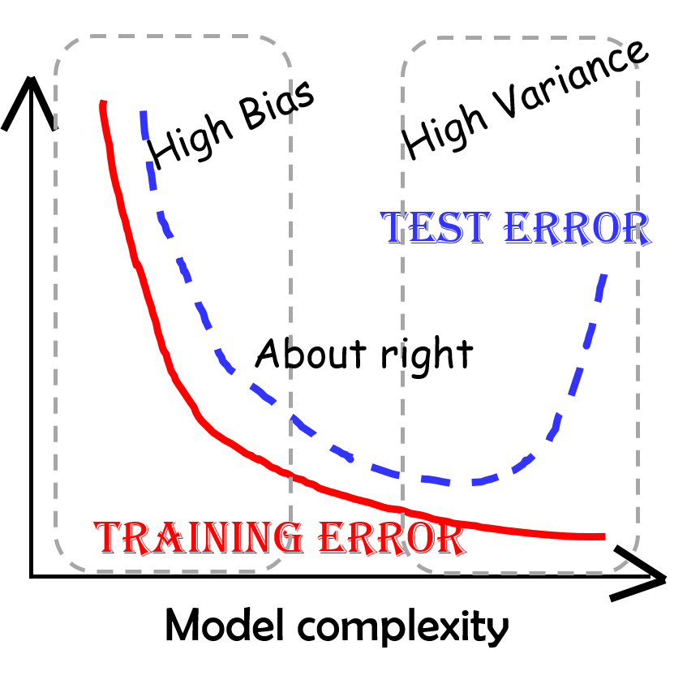

# CDA :sparkles:

## Reading work

Fill table with table from [course page](http://www2.imm.dtu.dk/courses/02582/).

|Week|Date|Subjects|Reading|
|-|-|-|-|
|1|?|a|a|
|2|?|a|a|
|3|?|a|a|
|4|?|a|a|
|5|?|a|a|
|6|?|a|a|
|7|?|a|a|
|8|?|a|a|


## Commit Message
```
<type>(<scope>): <subject>i
<BLANK LINE>
<body>
<BLANK LINE>
<footer>
+ <type> describes the kind of change that this commit is providing. Allowed types are:
 * feat (feature)
 * fix (bug fix)
 * docs (documentation)
 * style (formatting, missing semicolons, …)
 * refactor
 * test (when adding missing tests)
 * chore (maintain)
  - <scope> can be anything specifying the place of the commit change
  - <subject> is a very short description of the change, in the following format:
 * imperative, present tense: “change” not “changed”/“changes”
 * no capitalised first letter
 * no dot (.) at the end
```
- The BODY should include the motivation for the change and contrast this with previous behavior and must be phrased in imperative present tense
- The FOOTER should contain any information about Breaking Changes and is also the place to reference GitHub issues that this commit closes

This repo contains the work of [Daniel Thoren](https://github.com/DannyDannyDanny) for the course [Artificial Intelligence and multi-agent systems](http://kurser.dtu.dk/course/02285) at DTU.


## Group 1

### Ordinary Least Squares

Optimal solution for 1 Gaussian per class. Has **high variance** and **low bias**.

|Variance|Bias|
|--|--|
|Low|Hight|

$$
\begin{aligned}
Y &=  \color{red}\hat \beta_0 \color{black}+ \sum x_j \color{red}\hat\beta_j\color{black}\\
  &= X^T\color{red}\beta
\end{aligned}
$$

Draw a line minimizing **Residual Square Sum (RSS)** - i.e distance of every datapoint from the line squared and summed across all datapoints.


### Ridge regression




## Random Notes

$$
\begin{aligned}
Y &= d \times \pi\\
  &= 2,5 \space \text{m} \times \pi\\
  & = 7,853... \space \text{m} \\
  & = \color{red}7853 \space \text{mm} \\
\end{aligned}
$$

$$
\begin{aligned}
Y &= d \times \pi\\
  &= 2,5 \space \text{m} \times \pi\\
  & = 7,853... \space \text{m} \\
  & = \color{red}7853 \space \text{mm} \\
\end{aligned}
$$

$$
\begin{aligned}
(a+b)^2 &= (a+b)(a+b)           \\
        &= a^2 + ab + ba + b^2  \\
        &= a^2 + 2ab + b^2  
\end{aligned}
$$
